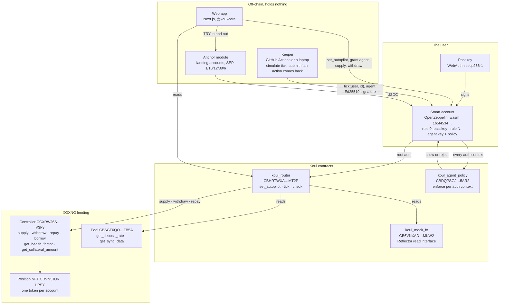
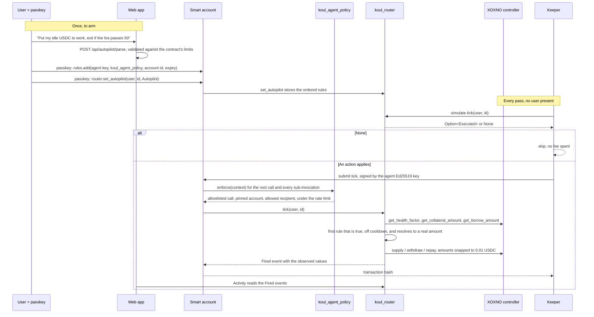

# Koul

## ▶ Try it live: https://koul.me

**Say what should happen to your money and when. Koul turns it into rules that live on Stellar and execute
themselves.** Stellar **testnet**, no login, no seed phrase.

| | |
|---|---|
| **Live app** | **https://koul.me** (the app itself is at https://app.koul.me) |
| Oracle admin, the demo lever for USD/TRY | https://koul-oracle.vercel.app/oracle |
| Repo | https://github.com/koul-me/koul |
| Pitch deck | _add link_ |
| Judge walkthrough | [How to evaluate](#how-to-evaluate), eight steps on the live app |
| Paste-ready summary | [`docs/submission-summary.md`](docs/submission-summary.md) |

---

## Overview

**What we are building.** Koul is a conditional execution engine on Stellar. A user writes a sentence, Koul turns it
into an ordered list of rules, and those rules are stored in a contract. A keeper pokes that contract on a schedule;
the contract itself re-reads the world, decides whether a rule is true, and executes the action in the same
transaction. The user's funds never leave their own smart account, and the key that pokes the contract is confined
by a policy contract that rejects anything the rules do not need.

**The problem.** Someone in Turkey holding lira watches it lose value, moves savings into dollars, and then has to
watch a screen: which pool pays more today, is my loan close to liquidation, has the exchange rate crossed the line
where I want out. Doing that by hand means being awake at the right moment. Handing it to a bot means handing over
the keys. Every "automation" in DeFi today is one of those two: a person watching charts, or custody given away.

**Who it is for.** People in high-inflation economies who save in dollars and want a floor under their downside,
and any on-chain user who wants a strategy to run without surrendering custody. For the hackathon the first user is
concrete: a lira saver who wants yield on XOXNO and an automatic exit if the lira breaks a level.

**Why it is worth solving.** Conditional execution is the missing primitive between a wallet and a strategy. Limit
orders exist on exchanges because nobody can watch a price all day. On-chain there is no neutral, custody-free way
to say "if this, then that" across protocols. Without it, the honest options are to watch manually or to trust a
custodian.

**Value proposition.** Koul is protocol-agnostic by design: the rule engine knows conditions and actions, not a
particular protocol. Three properties make it different from a bot:

1. **The rules are on-chain and readable.** They are contract state, not a config on someone's server. Anyone can
   read what your autopilot will do, including you.
2. **The decision is on-chain.** The keeper carries no logic: it simulates `tick` and submits only when the contract
   itself says an action applies. A malicious or broken keeper cannot invent an action.
3. **The key is scoped by a contract.** The agent key lives on the user's own smart account under a policy contract
   that allowlists the exact calls, pins the user's own position, restricts transfer recipients, rate limits, and
   expires. The user keeps the passkey; the agent gets a leash.

XOXNO lending is the first integration. The same engine is meant to point at swaps, perpetual DEXs and anything
else with a contract interface.

---

## Architecture

Two diagrams: who talks to whom, and what one autopilot run looks like end to end.





---

## Components

| Component | Where | Responsibility |
|---|---|---|
| **`koul_router`** | `contracts/koul_router` | The rule engine. Stores an ordered `Autopilot` per user and id, evaluates conditions against live reads, and executes at most one action per tick. `set_autopilot` and `clear_autopilot` need the user's auth; `tick` needs the user's auth, which the agent key satisfies through the policy; `check` is a read-only view the UI uses for live evaluation. Upgradeable by its admin so the address, and therefore every user's policy allowlist, stays stable. |
| **`koul_agent_policy`** | `contracts/koul_agent_policy` | Implements OpenZeppelin's `Policy` trait. Attached to the agent's context rule, it runs on the root call and on every sub-invocation: the `(contract, function)` pair must be allowlisted, `transfer` recipients must be allowlisted, XOXNO calls must name the user's own pinned account id, `withdraw` must send to the smart account itself, and a rolling window rate limit caps how often the key may be used. |
| **`koul_mock_fx`** | `contracts/koul_mock_fx` | Reflector's read interface (`lastprice`) plus an admin `set_price`, because no Reflector testnet feed carries TRY. One `set_oracle` call on the router swaps it for the real Reflector contract on mainnet. |
| **User smart account** | deployed per user | OpenZeppelin smart account, the same wasm Sembol and smart-account-kit deploy (`1b5f4534…`). Rule 0 holds the user's WebAuthn passkey. A second context rule holds Koul's Ed25519 agent key bound to `koul_agent_policy` with an expiry. Revoking that rule stops everything instantly. |
| **Keeper** | `keeper/` | The only off-chain moving part. Enumerates users with `list_users`, their autopilots with `list_ids`, simulates `tick`, and submits only when the contract returns an action, signing with the agent key and passing one context rule id per auth context. It also republishes the mock oracle price on testnet. It holds no user funds and makes no decisions. |
| **Frontend** | `web/` | Next.js app. Reads everything through `@koul/core`; writes are unsigned transactions the user signs with their passkey. Sentence-to-rules calls a server route that talks to a model and validates the result against the contract's limits before it can reach a signature. |
| **`@koul/core`** | `packages/core` | The typed SDK both the app and the keeper use: schemas that mirror the contract types, the ScVal codec, validation, reads, unsigned write builders, the permission derivation for the arm sheet, and the anchor module. |
| **Anchor module** | `packages/core/src/anchor`, `packages/core/src/funds.ts` | The TRY on and off ramp. Creates an ownerless landing account per transfer, runs the SEP handshake, forwards to the smart account with a pre-authorized transaction and merges itself away. Ported from Kumbara (MIT, see `LICENSE-KUMBARA`). |
| **Oracle admin** | `oracle-admin/` | A separate app on its own deployment that moves the mock USD/TRY price. Deliberately not part of the user app. |

---

## Stellar integrations

**XOXNO lending** (testnet). The router calls the controller for writes and both the controller and the pool for
reads:

- Controller writes, all with `caller = the user's smart account`: `supply(caller, account_id, spoke_id, assets)`,
  `withdraw(caller, account_id, withdrawals, to)`, `repay(caller, account_id, payments)`. The app also builds
  `borrow` for the user's own passkey, used to set up the health-guard demo.
- Controller reads: `get_health_factor(account_id)`, `get_collateral_amount(account_id, hub_asset)`,
  `get_borrow_amount(account_id, hub_asset)`.
- Pool reads: `get_deposit_rate`, `get_borrow_rate`, `get_sync_data` (cash and `max_utilization`),
  `get_supplied_amount`, `get_borrowed_amount`.
- Position NFT: `balance(owner)`, `get_owner_token_id(owner, index)`, `owner_of(token_id)`, `token_uri(token_id)`.
  The token id **is** the XOXNO account id, which is how the app finds a wallet's position without storing anything.
- Markets are `HubAssetKey { asset, hub_id }` rows in one pool. Koul uses spoke 3, hubs 1 and 2 for USDC, and the
  home page lists every testnet market XOXNO publishes.

**TR anchor** (`tr-mock-anchor.fly.dev`), TRY to USDC and back:

- **SEP-1** to discover the endpoints, **SEP-10** to authenticate as the landing account, **SEP-12** for the customer
  record, **SEP-38** for a firm quote, **SEP-6** `deposit-exchange` and `withdraw-exchange` for the transfer itself.
- The anchor refuses contract addresses, so each transfer gets an **ownerless landing account**: a classic G-account
  whose signers are removed after its forward and cleanup transactions are pre-authorized. The keeper sponsors the
  reserves and fee-bumps; nobody can redirect the funds, including us.
- Deposit: lira in by FAST, anchor pays the landing account, the pre-authorized forward moves USDC to the smart
  account, the account merges itself away. Withdrawal: one passkey-signed transfer to the landing account, then a
  pre-authorized payment to the anchor treasury with the memo, then cleanup.

**Reflector.** The router reads prices through Reflector's interface (`lastprice(asset) -> PriceData`) with a
staleness limit per rule. No Reflector testnet feed carries TRY, so `koul_mock_fx` implements the same interface and
`set_oracle` swaps it on mainnet. XOXNO itself prices collateral through Reflector, which is visible in a tick's
diagnostics.

**OpenZeppelin smart accounts.** `stellar-accounts` at rev `1e513890`, deployed wasm `1b5f4534…`, driven from
TypeScript with **smart-account-kit 0.6.2** and, in the browser, **@sembol/passkey-react 0.4.0** on Sembol's testnet
preset (wallet creation and passkey-signed calls are fee-sponsored through the public SDF relayer). Verifiers:
WebAuthn `CC7EKIHQ…OM3F`, Ed25519 `CAAVTMCB…HKN4`. Contracts build with **soroban-sdk 26.1**, Rust **1.91.1**,
stellar CLI **27.0.0**; the app uses **@stellar/stellar-sdk 16.0.1** and **Next.js 16**.

**Sembol.** Used for the passkey wallet layer, and contributed back: a pull request adding agent-permission hooks and
components to `@sembol/passkey-react` (`useAgentPermission`, `<GrantAgentAccess />`, `<AgentPermissions />`), with
tests, stories and docs: https://github.com/keyboord01/sembol/pull/3

---

## Key design decisions and trade-offs

**Session key on the user's own account, not a vault.** A vault would have been easier: deposit funds, let the
contract move them. We rejected it because the moment funds sit in our contract we are a custodian, and a bug is
everyone's loss. Instead the user keeps custody and grants a scoped, expiring key. The cost is complexity: every
action is an auth tree the smart account must validate, and one context rule id per auth context.

**A custom policy contract rather than a signer with a spending limit.** The policy allowlists `(contract, function)`
pairs, pins the user's own XOXNO account id, forces `withdraw` to return funds to the smart account, restricts USDC
transfer recipients to the XOXNO pool, and rate limits per rolling window. This is what makes "the agent can only do
what the rules need" a property of the chain rather than a promise. The trade-off is that adding a new action means
a new allowlist entry, so an armed autopilot cannot silently gain powers.

**Priority-ordered rules with one level of AND or OR, no if/else.** An autopilot is an ordered list; each rule has
one to three conditions joined by all or any, one action, one cooldown. On each tick the first rule that is true,
off cooldown, and has something real to do runs, and the tick stops. This is less expressive than a scripting
language and far easier to read, to validate on-chain, and to show honestly in a UI. Nesting was the first thing we
cut after testing the wording with people.

**Mandatory cooldowns.** Every rule carries one. Without it a true condition would fire every pass and grind a
position into dust through fees and rounding. The cooldown is stored per rule and enforced by the contract, not by
the keeper.

**The landing-account pattern for the anchor.** Anchors do not accept contract addresses, so a naive bridge would
mean an account someone controls. An ownerless account with pre-authorized forward and cleanup keeps the honest
property: from the moment it exists, the only transactions it can ever submit are the two we published.

**Agents propose, the user approves.** The sentence parser never signs anything. It returns data that is validated
against the contract's limits, shown as rule cards with the live values beside them, and only becomes state after
the user's passkey. Cashing out to lira is deliberately outside the agent's powers: a rule can bring USDC back to
the wallet, and the user confirms the TRY withdrawal themselves.

---

## Technical challenges and how we solved them

**One `context_rule_id` per authorization context.** The smart account's `__check_auth` receives the root call plus
every sub-invocation; a router tick is three or four contexts. Passing one id fails with
`ContextRuleIdsLengthMismatch`. The keeper walks the auth tree and repeats the rule id for each context.

**Auth trees bake exact arguments while positions accrue interest every ledger.** An amount read during simulation
is already stale at execution. Every amount is snapped down to 0.01 USDC, moves under 1 USDC are skipped, and
repayments round the debt up by one grain so a signed amount stays valid for hours; the controller refunds the
excess.

**A hub only releases its liquid cash, and never past its utilisation ceiling.** XOXNO answers with errors 112 and
127. `withdrawable()` caps by cash and by `borrowed / (supplied - w) <= max_utilization`, minus a grain of margin.

**No TRY on any Reflector testnet feed.** We implemented Reflector's read interface in `koul_mock_fx` rather than
inventing our own, so mainnet is a single `set_oracle` call.

**No protocol-native scheduler on Soroban.** SoroCron exists, but its executor contract is the invoker, so it cannot
carry a user's smart account authorization. Hence our own keeper, which is deliberately dumb.

**Two copies of one library broke every signature.** `@koul/core` had its own install of the Stellar SDK, so an
`xdr.ScVal` built inside it was not an instance of the class the wallet kit checks, and every passkey action died
with a generic "something went wrong". One pnpm workspace, one physical copy, fixed it. Errors now surface the
chain's own message instead of a wrapper's.

**WebAuthn allows one ceremony at a time.** Arming runs up to three prompts in a row; a second prompt starting while
one was open aborted both. A module-wide lock serialises them, and a dismissed prompt is reported as a cancellation
rather than a failure.

**A tick can lose a race with an oracle round.** XOXNO's health-factor read touches a Reflector round key that
changes every five minutes, so a tick simulated just before the boundary can fail at execution with "outside of the
footprint". The next pass succeeds; the keeper treats it as any other failed submission and spends nothing.

---

## Deployed contracts (Stellar testnet)

| Contract | Address | WASM hash |
|---|---|---|
| `koul_router` | [`CBHRTWXARGZCUDBE7IX4SZV7GDFA6PRQICZQPUSOUPN3YDCVPXQBMT2P`](https://stellar.expert/explorer/testnet/contract/CBHRTWXARGZCUDBE7IX4SZV7GDFA6PRQICZQPUSOUPN3YDCVPXQBMT2P) | `608bca585be781d8f5edb8aa6d1e7a51d6b975cce1f15e624e198b81d1eb1aa4` |
| `koul_agent_policy` | [`CBDQPSGJDJUGLUIYTLAVH7C7FQE3ZN2HXOKYELNPEEUHFPV52QRI5AR2`](https://stellar.expert/explorer/testnet/contract/CBDQPSGJDJUGLUIYTLAVH7C7FQE3ZN2HXOKYELNPEEUHFPV52QRI5AR2) | `ad6bddd790970182a9a6bf86d537c8f07e63b4660bdfbcdb68cef5d54aea32f7` |
| `koul_mock_fx` | [`CB6VNXADXR3XHCS4EKV5ZR5UJUZYQ5BZTPRHCNQE3XMKQMB4LJG6MKW2`](https://stellar.expert/explorer/testnet/contract/CB6VNXADXR3XHCS4EKV5ZR5UJUZYQ5BZTPRHCNQE3XMKQMB4LJG6MKW2) | `68d24e0791f6c6dac01f97ff048eac19f431905bb9de63cf139bbdf1d38532f0` |

Contracts we integrate with, for reference:

| Contract | Address |
|---|---|
| XOXNO controller | [`CCXRWJ6SIU2WPFEGLFGJVITPL57QAYIMIO6OAM2NBGNDQSSCK2FFV3F3`](https://stellar.expert/explorer/testnet/contract/CCXRWJ6SIU2WPFEGLFGJVITPL57QAYIMIO6OAM2NBGNDQSSCK2FFV3F3) |
| XOXNO pool | [`CBSGF6QOQAMPFBEVSYPEQHSZRIHJ6RCGUPCRDMUX36DEKRWFAO2PZB5A`](https://stellar.expert/explorer/testnet/contract/CBSGF6QOQAMPFBEVSYPEQHSZRIHJ6RCGUPCRDMUX36DEKRWFAO2PZB5A) |
| XOXNO position NFT | [`CDVN5JU675MEDPVRPCYC45AHFC275UH57WEU5OTFE4WFGZBNN7HTLPSY`](https://stellar.expert/explorer/testnet/contract/CDVN5JU675MEDPVRPCYC45AHFC275UH57WEU5OTFE4WFGZBNN7HTLPSY) |
| USDC (SAC) | [`CBIELTK6YBZJU5UP2WWQEUCYKLPU6AUNZ2BQ4WWFEIE3USCIHMXQDAMA`](https://stellar.expert/explorer/testnet/contract/CBIELTK6YBZJU5UP2WWQEUCYKLPU6AUNZ2BQ4WWFEIE3USCIHMXQDAMA) |
| Smart account wasm | `1b5f4534a76322da2ad7c745f6900857a6802b0ca79850c35a03561df997785a` |
| WebAuthn verifier | [`CC7EKIHQP3TN4CARQDND6CEOY2UXLWWC2X5GHTD5NLAT7BG5GPZIOM3F`](https://stellar.expert/explorer/testnet/contract/CC7EKIHQP3TN4CARQDND6CEOY2UXLWWC2X5GHTD5NLAT7BG5GPZIOM3F) |
| Ed25519 verifier | [`CAAVTMCBXEIBPR64EAASKFXERVPYFZA2JYP5A3BG6PESWEFUJX5IHKN4`](https://stellar.expert/explorer/testnet/contract/CAAVTMCBXEIBPR64EAASKFXERVPYFZA2JYP5A3BG6PESWEFUJX5IHKN4) |

Keeper account `GAFHZTSL63YZYU35SCHDOGOMXQ25266DBQYG7KETG6HC2AHBIZMGXP6U` pays fees and sponsors landing accounts.
Agent key `GBVD753EJMRQYI6WQCWC4OMDCNMGQMHXRT7IOAHTT3FD7ON6OQXTSAK3` is the one users grant; it holds nothing.

Every on-chain change, with transaction hashes, is in [`docs/build-log.md`](docs/build-log.md); the go/no-go gates
that came before are in [`docs/phase0.md`](docs/phase0.md).

---

## Setup, run and test

**Prerequisites.** Rust 1.91.1 with the `wasm32v1-none` target, stellar CLI 27.0.0, Node 20, pnpm 8. `scripts/env.sh`
pins the CLI and toolchain: `source scripts/env.sh` before any contract work. Contracts build only with
`stellar contract build`; a bare `cargo build --target wasm32v1-none` fails because soroban-sdk's spec shaking needs
the CLI.

```sh
git clone https://github.com/koul-me/koul && cd koul
pnpm install            # one workspace: web, keeper, packages/core, oracle-admin
```

**Environment.** `keeper/.env` (see `keeper/.env.example`): `KEEPER_SECRET` and `AGENT_SECRET` are funded testnet
secrets; `ROUTER_V1`, `KOUL_POLICY`, `MOCK_FX` are the addresses above. `web/.env.local`: `ANTHROPIC_API_KEY` or
`OPENAI_API_KEY` for the sentence parser, `KEEPER_SECRET` for the demo funds routes. `oracle-admin` needs
`ORACLE_ADMIN_SECRET`. Nothing secret is ever exposed under a `NEXT_PUBLIC_` name.

**Contracts.**

```sh
source scripts/env.sh
stellar contract build                      # all three
cd contracts/koul_router && cargo test      # 10 unit and scenario tests
stellar contract upload --wasm target/wasm32v1-none/release/koul_router.wasm --source <identity> --network testnet
stellar contract invoke --id CBHRTWXARGZCUDBE7IX4SZV7GDFA6PRQICZQPUSOUPN3YDCVPXQBMT2P \
  --source <identity> --network testnet -- upgrade --new_wasm_hash <hash>
```

The router is upgraded in place so its address, and therefore every user's policy allowlist, never changes.

**Frontend.** `cd web && pnpm dev` on http://localhost:3000. **Oracle admin.** `cd oracle-admin && pnpm dev` on
port 3100. **Keeper.**

```sh
cd keeper
pnpm keeper:once              # one pass over every user and autopilot
pnpm keeper -- --interval 30  # the demo loop: reacts within seconds
```

In this repo the keeper also runs itself: `.github/workflows/keeper.yml` ticks every five minutes and on demand,
with the two secrets stored as GitHub repository secrets. Two keepers are safe; whichever loses a race simulates to
`None` and spends nothing.

**Tests.**

```sh
cd contracts/koul_router && cargo test    # rule evaluation, ordering, cooldowns, amounts, registries
cd packages/core && pnpm test             # 14: codec round trips, validation, templates, parser boundaries
cd packages/core && pnpm parse-test       # live: four sentences, one of them impossible
cd packages/core && pnpm smoke            # live reads and unsigned writes against testnet
cd keeper && pnpm test && pnpm policy-deny # landing accounts; policy rejections with the agent key
cd web && npx tsc --noEmit && npx next build
```

---

## How to evaluate

Everything below runs on https://app.koul.me against Stellar testnet. A passkey belongs to the origin it
was created on, so create a wallet on the domain rather than expecting a local one to appear.

1. **Create a wallet.** Press *Create wallet* and confirm with your device. No seed phrase appears because there is
   none: an OpenZeppelin smart account is deployed with your passkey as rule 0. Deployment and later signatures are
   fee-sponsored.
2. **Bring lira in.** *Funds → Deposit lira*, enter an amount, and the app opens a transfer through the anchor: a
   landing account is created, SEP-10, SEP-12, SEP-38 and SEP-6 run, and the FAST instructions the anchor returned
   appear with a reference. On the sandbox, press *Sandbox: pretend I sent the lira*. USDC lands in your wallet and
   the temporary account closes itself. Each step shows its technical detail and its transaction.
3. **Write a rule in a sentence.** *Autopilots → New autopilot*, type for example _"whenever I have at least 10 USDC
   sitting in my wallet put it into the pool that pays more, and pull everything out if the lira passes 50"_, and
   press *Turn into rules*. The rules appear as cards with the live value beside each condition and a mark on any
   value Koul filled in. Anything the router cannot do comes back as a note instead of an invented rule; try
   _"buy me gold when bitcoin dips"_ to see it refuse.
4. **Arm it.** The sheet lists exactly what Koul's key will be allowed to do, for how long, and how many
   confirmations it will take. Arming opens your XOXNO position if you have none, grants the scoped key, and stores
   the rules on-chain. Each step names its transaction.
5. **Watch it fire.** The keeper simulates `tick`; when a rule is true it submits. *Activity* shows the run in plain
   words with the observed values and a link to the transaction on stellar.expert. To force the lira exit, open the
   oracle admin at https://koul-oracle.vercel.app/oracle and press *50.25 (lira shock)*: within a pass, the rule
   withdraws to your wallet.
6. **See an out-of-policy action rejected.** In the repo, `cd keeper && pnpm policy-deny` sends four agent-signed
   calls straight at XOXNO: a withdrawal to a foreign account (rejected, `7109`), a repayment on somebody else's
   XOXNO account (`7108`), a `borrow`, which no rule needs and the allowlist therefore omits (`7103`), and one
   allowed withdrawal to the user's own wallet as a control. The rejections come from the chain, not from our code.
7. **Take lira out.** *Funds → Withdraw lira* with an IBAN. One passkey confirmation moves USDC to the landing
   account; the anchor pays out and the account cleans itself up. Cashing out is never something the agent can do.
8. **Read the rules yourself.** Everything is on-chain: `check(user, id)` returns per-condition truth and the live
   value each was compared against, and the router's `Fired` events carry what was observed at the moment it acted.

---

## Stellar skills used

The hackathon's skill pack shaped how we built. The ones we actually leaned on, by path:

| Skill | What we used it for |
|---|---|
| `skills/soroban/SKILL.md` | Contract structure, storage types and TTL, `require_auth` and auth trees, cross-contract clients, `contracterror` and `contractevent`, and the upgrade pattern that keeps the router's address fixed. |
| `skills/dapp/SKILL.md` | Building and simulating from TypeScript, `AssembledTransaction`, passkey smart accounts and the signing flow, and the error handling the UI now surfaces. |
| `skills/data/SKILL.md` | Reading chain state through Stellar RPC: simulation as a read, `getEvents` with topic filters, and the retention window that made our first Activity query fail. |
| `skills/standards/SKILL.md` | The SEP handshake for the anchor: SEP-1 discovery, SEP-10 authentication, SEP-12 customer data, SEP-38 quotes, SEP-6 deposit-exchange and withdraw-exchange. |
| `skills/deploy-stellar-mainnet/SKILL.md` | The mainnet checklist we are working against: what must be audited, monitored and swapped (`set_oracle` to real Reflector) before this leaves testnet. |
| `skills/agentic-payments/SKILL.md` | Background on agent-initiated payments on Stellar, which informed the "agent proposes, user approves" boundary and the scoped-key design. |

XOXNO's own contracts and configs (`XOXNO/rs-lending-xlm`) were the reference for hub and spoke semantics, market
parameters and the position NFT; the ABIs we fetched from testnet are in [`docs/abi/`](docs/abi).

---

## Roadmap toward SCF

**Next, in order.**

1. **A Koul MCP server.** Expose autopilots as tools so anyone can manage them by talking to their own AI assistant:
   read the portfolio, propose rules, explain what would fire and why. The server never holds funds or keys; it
   returns unsigned transactions the user signs with their passkey, which is the same boundary the web app uses.
2. **More protocols behind the same engine.** The router's conditions and actions are deliberately protocol-shaped
   rather than XOXNO-shaped. Swap venues come first (an action that routes through an aggregator), then perpetual
   DEXs, where conditional execution matters most: reduce exposure when funding flips, close when a level breaks.
3. **Mainnet with audited contracts.** The router and the policy are small and self-contained by design, which is
   what makes an audit affordable. The mock oracle disappears behind `set_oracle`; Reflector takes its place.
4. **A keeper anyone can run.** The keeper is already permissionless in effect: it only submits what the contract
   authorises. Publishing it with an incentive makes liveness independent of us.

**Funding.** We are applying to the Stellar Community Fund, Build Award, with the MCP server and the second protocol
integration as the milestones, and the audit as the tranche before mainnet.

---

## Team

- **Atahan Yıldırım**, cofounder — [github.com/atahanyild](https://github.com/atahanyild)
- **Ahmed Murshed**, cofounder

Contacts for judging are on the submission form; issues on this repository reach both of us.

---

## License and notes

This repository is MIT ([`LICENSE`](LICENSE)). One exception: `packages/core/src/anchor` and its keeper counterpart
are ported from [Kumbara](https://github.com/keyboord01/kumbara) (MIT, Sembol 2026), whose notice is kept in
[`LICENSE-KUMBARA`](LICENSE-KUMBARA) and in each file's header.

**XOXNO lending is PolyForm Noncommercial.** We do not vendor, fork or redistribute any XOXNO code. Koul calls the
deployed XOXNO contracts over the network like any other user, and the interfaces in [`docs/abi/`](docs/abi) were
fetched from the chain for reference.

Everything here runs on Stellar **testnet**. The FX oracle is a mock with the Reflector interface, and the anchor is
the TR Mock Anchor sandbox. No real money moves anywhere in this repository.

Build and operations notes that used to live in this file, including the run guide in more detail, are in
[`docs/README-build-guide.md`](docs/README-build-guide.md).
